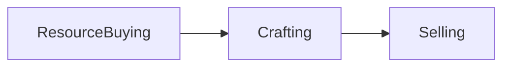

# Projeto Fundamentos de Programação 2022/2023

## Introdução 
Todos os grupos devem implementar em Python um jogo chamado *Fantasy Battle Defense Dealer*. O jogo pode ser implementado com a linha de comandos, ou para valores extra em PyGame. 

## Contexto do Jogo

O jogo consiste em gerir uma loja onde o jogador tem que comprar recursos, criar items e vendê-los de forma a optimizar o seu lucro total, negociando as várias transações. O objectivo pedagógico deste jogo é para realçar a importância de Classes, Objectos, Herança e Funções. O qual deve ser necessário para uma implementação eficiente deste jogo. 

### Objectivo do Jogo
O objectivo do jogo é atingir um lucro total de **100k$** ou um valor estabelecido pelo grupo sendo este um valor substancialmente suficiente considerando a economia estabelecida no jogo.

### Fluxo do Jogo
Cada turno (ou dia) consite em 3 fases: Resource Buying; Crafting e Selling Items. Ao qual repete sucessivamente até atingir o objectivo estabelecido, ou até o jogador ficar sem dinheiro para continuar (ou seja ``` Total_Profit <= 0 ```).



### Resource Buying 
Nesta fase a tarefa do jogador é comprar recursos tendo em conta as receitas que tem ao seu dispor, o seu skill e o preço destes recursos. 

Nesta fase o jogador pode:
  - Comprar Recursos (Ver abaixo a lista de Recursos)
  - Comprar Receitas (Maximo 1 receita por dia)
  - Visualizar Preços dos Recursos
  

### Crafting 
Nesta fase a tarefa do jogador é criar items para vender na sua loja considerando todos os recursos que estão no seu inventario e as receitas que tem ao seu dipor. 

Cada vez que um jogador faz craft existe uma taxa de sucesso que consiste:

``` PlayerCraftAttempt >= SuccessRating ```, onde o ```SuccessRating``` é definido em cada item (ou seja cada item tem um valor de success rating), e o ```PlayerCraftAttempt``` é calculado da seguite forma:

``` PlayerCraftAttempt = PlayerExp * 1d10 ``` , onde ``` 1d10 ``` consiste num valor aleatório entre 1 e 10. 

É importante realçar que todos os recursos são consumidos durante o CraftAttempt, mesmo se este falhar o processo.

### Resource Selling
Nesta fase a tarefa do jogador é definir os preços dos items de forma a maximizar o seu lucro. Quando este é estabelecido começa o processo de venda de produtos.

#### Processo de Venda a Clientes
O numero de clientes que entram na loja irá variar entre um intervalo pré-definido pelo grupo. Cada cliente irá escolher de forma aleatória um produto e decide se irá fazer a compra ou não de acordo com uma função quadratica (ver abaixo). 

 corresponde ao valor maximo que cada cliente está disposta a comprar o item, enquanto a linha curva (vermelha) corresponde ao valor que cada item corresponde. É importante realçar que esta curva poderá depender do valor ou dificuldade de cada item para fazer craft.")


Se o valor do item ultrapassar o decision threshold estabelecido por cada cliente (este também aleatório mas dependendo do preço médio de cada item) o cliente irá rejeitar a compra, caso contrário faz a transacção com sucesso. É importante realçar que a curva da função quadrática poderá variar de item para item consoante variaveis determinadas pelo grupo (e.g. recursos consumidos, dificuldade em fazer craft, raridade). 

### O Jogador

O jogador tem varios attributos, e estes incluem:

  - Dinheiro Corrente
  - Inventário de Recursos
  - Inventário de Items
  - Barra de Experiência (Que aumenta com cada sucesso em crafting)


### Iniciar o Jogo

No início do jogo o jogador terá acesso a um X numero de receitas, Y numero de dinheiro e Z numero de recursos. O valor de X, Y e Z ficará ao critério de cada grupo.


## Objetivos e Critério de Avaliação

Este projeto tem os seguintes objetivos:

-   **O1** - Programa deve funcionar como especificado. Atenção aos detalhes, pois é fácil desviarem-se das especificações caso não **leiam o enunciado com atenção**.
-   **O2** - Projeto e código bem organizados, nomeadamente:
    -   Código devidamente comentado e indentado.
    -   Inexistência de código "morto", que não faz nada, como por exemplo variáveis, propriedades ou métodos nunca usados.
    -   Projeto compila e executa sem erros e/ou _warnings_.
-   **O3** - Projeto adequadamente documentado com *comentários* descrevendo a funcionalidade de várias secções do código.
-   **O4** - Repositório Git deve refletir boa utilização do mesmo, nomeadamente:
    -   Devem existir _commits_ de todos os elementos do grupo, _commits_ esses com mensagens que sigam as melhores práticas para o efeito (como indicado [aqui](https://chris.beams.io/posts/git-commit/), [aqui](https://gist.github.com/robertpainsi/b632364184e70900af4ab688decf6f53), [aqui](https://github.com/erlang/otp/wiki/writing-good-commit-messages) e [aqui](https://stackoverflow.com/questions/2290016/git-commit-messages-50-72-formatting)).
    -   Ficheiros binários não necessários, não devem estar no repositório. Ou seja, devem ser ignorados ao nível do ficheiro `.gitignore`.
-   **O5** - Relatório em formato [Markdown](https://guides.github.com/features/mastering-markdown/) (ficheiro `README.md`), organizado da seguinte forma:
    -   Título do projeto.
    -   Autoria:
        -   Nome dos autores (primeiro e último) e respetivos números de aluno.
        -   Informação de quem fez o quê no projeto. Esta informação é **obrigatória** e deve refletir os _commits_ feitos no Git.
        -   Indicação do repositório Git utilizado. Esta indicação é opcional, pois podem preferir manter o repositório privado após a entrega.
    -   Arquitetura da solução:
        -   Descrição da solução, com breve explicação de como o código foi organizado, bem como dos algoritmos não triviais que tenham sido implementados.
    -   Referências, incluindo trocas de ideias com colegas, código aberto reutilizado (e.g., do StackOverflow) e bibliotecas de terceiros utilizadas. Devem ser o mais detalhados possível.
    -   **Nota:** o relatório deve ser simples e breve, com informação mínima e suficiente para que seja possível ter uma boa ideia do que foi feito. Atenção aos erros ortográficos e à correta formatação [Markdown](https://guides.github.com/features/mastering-markdown/), pois ambos serão tidos em conta na nota final.

O projeto tem um peso de 5 valores na nota final da disciplina e será avaliado de forma qualitativa. Isto significa que todos os objetivos têm de ser parcialmente ou totalmente cumpridos. A cada objetivo, O1 a O5, será atribuída uma nota entre 0 e 1. A nota do projeto será dada pela seguinte fórmula:

_N = 10 x O1 x O2 x O3 x O4 x O5_

Em que _D_ corresponde à nota da discussão e percentagem equitativa de realização do projeto, também entre 0 e 1. Isto significa que se os alunos ignorarem completamente um dos objetivos, não tenham feito nada no projeto ou não comparecerem na discussão, a nota final será zero.

### Requisito Mínimo do Projeto

O requisito minimo do projeto é implementar o sistema como descrito acima. Este deve incluir no minimo:

  - Os 4 Recursos descritos (Wood, Iron, Leather and Gold)
  - 4 Tipos de Itens destintos (Sword, Hammer, Armor e Bows) - No qual Armor tem 3 subtipos como Helm, Chest e Feet.
  - 15 Receitas para Crafting de Itens
  - O Processo de Compra e Venda
  - O Main Loop do Jogo
  - Interface em Linha de Comandos

### Pontuação Extra

**Importante**: Façam o minimo requerido primeiro antes de tentarem fazer mais funcionalidades!

Os alunos que vão para além do expectavel irão receber valores extra e isto inclui:
 - Interface em PyGame
 - Sistema de "Barter" - O NPC pode negociar com com o Jogador (contraproposta)
 - Inclusão de mais mecanicas como: 
   * Mais Recursos 
   * Sistema de Crafting mais refinado
   * Mais Items
   * Selling Experience (Permite ao jogador vender a valores mais altos do que o normal)
 - Sistema de Audio

## Entrega
O projeto deve ser entregue por **grupos de 2 alunos** via Moodle até às **23:59** do dia **9 de Dezembro 2022**. Um (e apenas um) dos elementos do grupo deve ser submeter um ficheiro `zip` com a solução completa, nomeadamente:

-   Pasta escondida `.git` com o repositório Git local do projeto.
-   Pasta do projeto, contendo os ficheiros todos deste.
-   Ficheiro `README.md` contendo o relatório do projeto em formato [Markdown](https://guides.github.com/features/mastering-markdown/).
-   Ficheiro de imagem contendo o Fluxograma. Este ficheiro deve ser incluído no repositório em modo Git LFS.
-   Outros ficheiros de configuração, como por exemplo `.gitignore` e `.gitattributes`.

**Não serão avaliados projetos sem estes elementos e que não sejam entregues através do Moodle.**

## Honestidade académica
Nesta disciplina, espera-se que cada aluno siga os mais altos padrões de honestidade académica. Isto significa que cada ideia que não seja do aluno deve ser claramente indicada, com devida referência ao respectivo autor. O não cumprimento desta regra constitui plágio.

O plágio inclui a utilização de ideias, código ou conjuntos de soluções de outros alunos ou indivíduos, ou quaisquer outras fontes para além dos textos de apoio à disciplina, sem dar o respectivo crédito a essas fontes. Os alunos são encorajados a discutir os problemas com outros alunos e devem mencionar essa discussão quando submetem os projetos. Essa menção **não** influenciará a nota. Os alunos não deverão, no entanto, copiar códigos, documentação e relatórios de outros alunos, ou dar os seus próprios códigos, documentação e relatórios a outros em qualquer circunstância. De facto, não devem sequer deixar códigos, documentação e relatórios em computadores de uso partilhado, e muito menos usar repositórios Git públicos (embora os mesmos possam ser tornados públicos 12h após a data limite de submissão).

Nesta disciplina, a desonestidade académica é considerada fraude, com todas as consequências legais que daí advêm. Qualquer fraude terá como consequência imediata a anulação dos projetos de todos os alunos envolvidos (incluindo os que possibilitaram a ocorrência). Qualquer suspeita de desonestidade académica será relatada aos órgãos superiores da escola para possível instauração de um processo disciplinar. Este poderá resultar em reprovação à disciplina, reprovação de ano ou mesmo suspensão temporária ou definitiva da ULHT.

_Texto adaptado da disciplina de [Algoritmos e Estruturas de Dados](https://fenix.tecnico.ulisboa.pt/disciplinas/AED-2/2009-2010/2-semestre/honestidade-academica) do [Instituto Superior Técnico](https://tecnico.ulisboa.pt/pt/)_

## Licenças
Este enunciado é disponibilizado através da licença [CC BY-NC-SA 4.0](https://creativecommons.org/licenses/by-nc-sa/4.0/).

## Metadados
-   Autores: [Phil Lopes](https://github.com/worshipcookies) e [Diogo Andrade](https://github.com/DiogoDeAndrade)
-   Curso: [Licenciatura em Videojogos](https://www.ulusofona.pt/licenciatura/videojogos)
-   Instituição: [Universidade Lusófona de Humanidades e Tecnologias](https://www.ulusofona.pt/)

